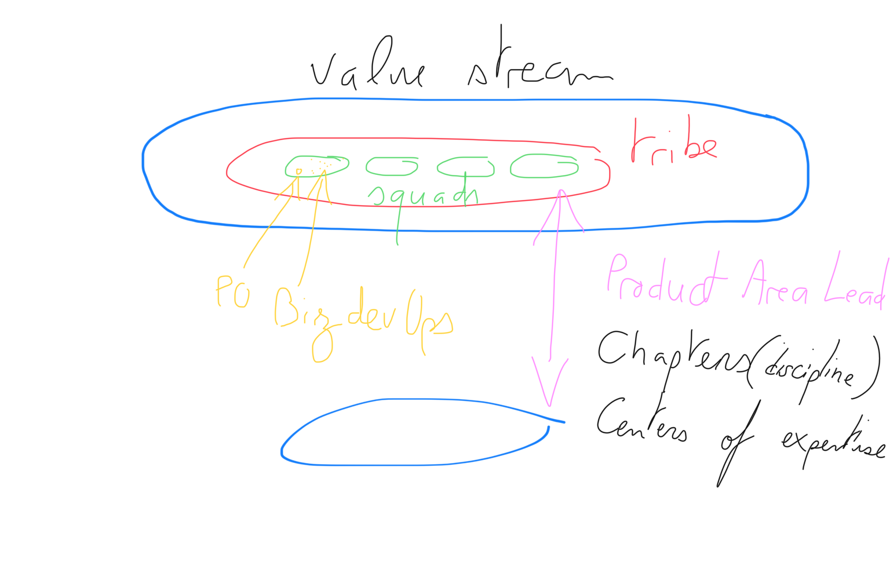
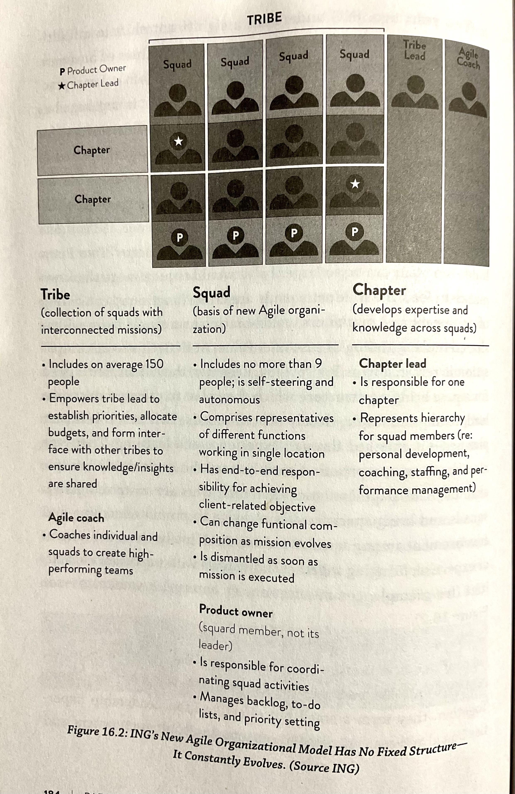
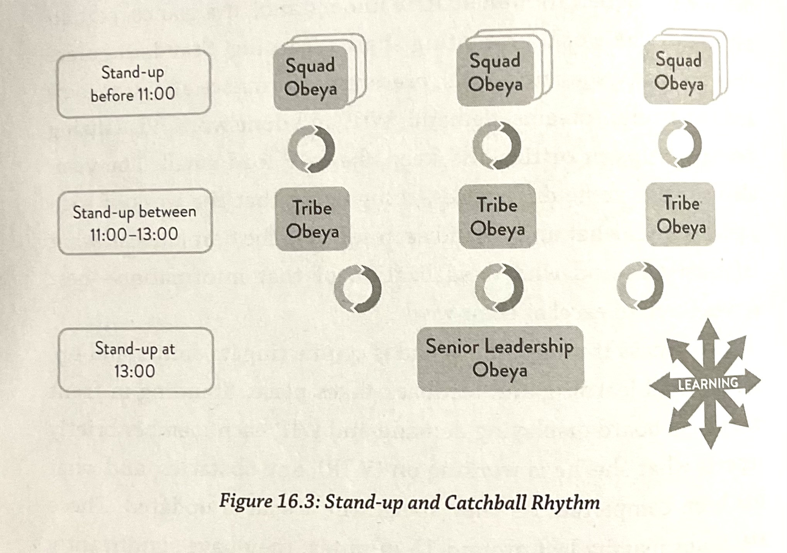
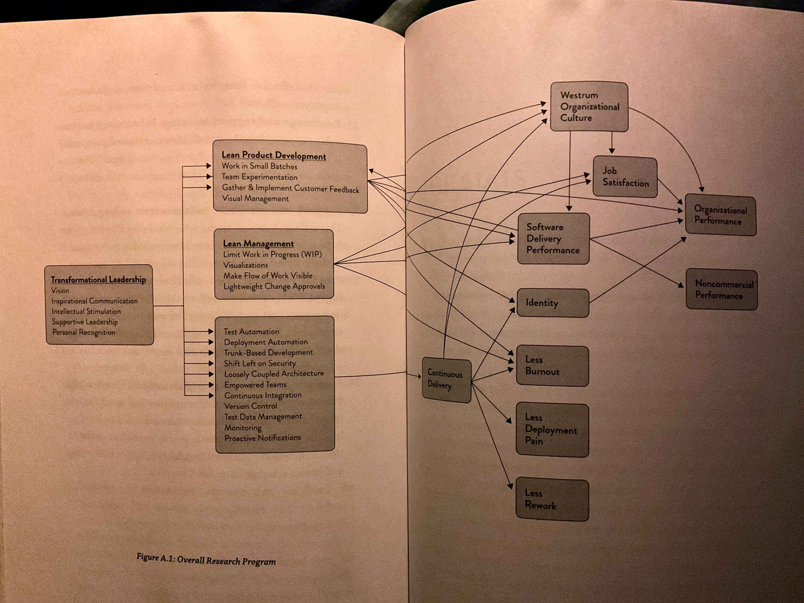

# Ideas

- [ ] Changing WIN by WIP (demand, WIP, done work)
- [ ] Chapter lead inside a squad (des managers au sein des squads mais par domaine d’expertise)

# Notes 

## Part 1: What we found

### Accelerate
Technology changes and market uncertainty force organisations to accelerate to remain competitive. To transform organisations, leaders must focus on capabilities rather than maturity when measuring changes. The following factors do not predict performance: age and technology, dev vs ops team, change approval boards.

### Measuring performance 
Reliable measurements of delivery tempo: 
* Delivery lead time : time from code commit to successful run in production
* Deployment frequency : how frequent is changed pushed in production
Reliable measurements of quality:
* Time to restore service : time from issue declaration to service restored
* Change fail rate : percentage of changes with failure or remediation outcomes

Statistical analysis was done by regrouping candidates into clusters high/mid/low:
|                         | Low performers      | High performers    |
|-------------------------|---------------------|--------------------|
| Delivery lead time      | 1 week to 1 month   | <1 hour            |
| Deployment frequency    | 1x per week / month | Multiple times/day |
| Time to restore service | 1 day to 1 week     | <1 hour            |
| Change fail rate        | 31-45%              | 0-12%              |

Delivery performance matters because it is shown as directly correlated to the performance of an organization and its non-commercial goals (satisfaction, quality, etc.). The ability to work and deliver in small batches allows rapid feedback loops, which in turns enable a more experimental approach to product development. **Strategic software should not be outsourced** to keep control on delivery performance.

> The ability to take an experimental approach to product development is highly correlated with the technical practices that contribute to continuous delivery

### Measuring and changing culture
Organisational culture predicts the way information flows through an organisation, and therefore performance outcomes. To mesure culture, the author uses Westrum typology of organisational cultures: pathological (power oriented), bureaucratic (rule oriented), generative (performance oriented). A survey then allows to classify organisations into Westrum constructs.

> When looking at key ingredients for high-performing teams […] « who is on a team matters less than how the team members interact, structure their work and view their contributions. » (Google 2015)

> Accident investigations that stop at « human error » are not just bad but dangerous. Human error should, instead, be the start of the investigation 

Continuous delivery and lean management triggers culture change which in turn increase software delivery and organisation performance, as well as employee satisfaction.

### Technical practices
Continuous delivery concepts:
* Build quality in: eliminate the need for inspection
* Work in small batches: deliver measurable business outcomes quickly
* Automate repetitive tasks: free up people for problem solving
* Relentlessly pursue continuous improvement
* Everyone is responsible: focus on organisational goals rather than department goals
It is enabled by configuration management (version control), continuous integration and continuous testing. 

Continuous delivery brings the following outcomes:
* improves delivery performance
* influences culture towards generative culture 
* helps identification of the employees to the organization
* improves the way work « feels » : lowers deployment pain and team burnout
* lowers amount of unplanned work or rework

> Keeping system and application configuration in version control was more highly correlated with software delivery performance than keeping application code in version control.

> Having automated tests primarily created and maintained either by QA or an outsourced party is not correlated with IT performance.

> Teams that did well had fewer than three active branches at any time, their branches had very short lifetimes (less than a day) … and never had « code freeze » or stabilization periods.

Adopting continuous delivery requires to rethink team interactions and the tools and processes they use. Architecture must be simplified to ensure automation is not too expensive to create and maintain.

### Architecture
No correlation between system type (mainframe, web, etc.) and delivery performance, but low performers are more likely to be outsourcing custom developments. Instead, what differenciates low and high performers are the inherent capabilities/behavior of the systems:
- deployability independently of other teams or systems
- autonomous testing without the need of integrated environment
There is a direct correlation between communication bandwidth required to get the work done and performance.

Allow teams to choose their own tools but standardized operational platforms also help respecting security and operability standards: be careful to always focus on usability and satisfaction when providing internal tools.
>What #tools or #technology you use is irrelevant if the people who must use them hate using them, or if they don’t achieve the outcomes we care about.

### Integrating infosec
Shifting left on #security means making security part of the delivery process. Instead of security reviews at the end of the delivery cycle, it needs to shift to giving developers the means to build security in: security teams cannot ensure reviews when deployments are frequent and it avoids bottlenecks and substential rework needs. High performers spends 50% less time on security issues thanks to this.

DevOps ==> Rugged DevOps / DevSecOps

### Management practices
#Lean management on software relies on
- limit work in progress (WIP)
- Visual management (boards/displays available to all)
- Feedback from production
- Lightweight change approval
WIP in itself is not sufficient and a strong positive effect is seen when coupled with visual displays and feedback loop.

In terms of performance:
No change approval / peer review process > High rish only change mgt > external body approval

On external body #change reviews: 
>This idea is a form of risk management theater: we check boxes so that when something goes wrong, we can say that at least we followed the process. At best, this process only introduces time delays and handoffs

### Product development

#Lean product management starts a virtuous cycle:
> Improving your software delivery effectiveness will improve your ability to work in small batches and incorporate customer feedback along the way.

Team experimentation is key to organizational performance in terms of profitability, productivity, market share. That’s because #innovation is otherwise prohibited if teams cannot change requirements/specifications without authorization. But it only works if there it takes into account quick feedback loops into design.

### Making work sustainable

#Deployment_Pain relates to the stress/anxiety caused by releasing a change in production. It is directly correlated to continuous delivery practices (example from Microsoft with work/life balance satisfaction scores which doubled after adoption of continuous delivery practices).

> If your team has no visibility into code deployment [..] that’s another warning that software delivery could be low.

#Configuration_drift is when manualy configured environments tend to deviate substantially from one another, leading to significant amounts of work to understand differences and making further changes that add to the problem.

#Burnout feelings can be reduced by adopting lean practices and technical practices. Aggravating factors are: power oriented organization culture, deployment pain, lack of effectiveness of leaders, lack of investments in devops, organizational performance issues.

Alignment between organizational values and individual values increases purpose and commitment, therefore reducing employee burnout.

### Employee satisfaction and diversity

Employee satisfaction depends strongly on having the right tools and resources to do your work.

#Diversity matters and research shows that teams with more diversity are smarter, have better team performance and achieve better business outcomes. #Inclusion must be present (that is make everyone feel welcomed and valued) for diversity to take hold

### Leaders and managers

5 characteristics of a transformational leader:
- Vision (clear understanding of where to go)
- Inspirational communication (motivates other)
- Intellectual stimulation (challenges)
- Supportive leadership (care)
- Personal recognition (acknowledges and compliments)

=> Highly correlated with software delivery performances.
But top 10% of transformational leaders’ teams are equally or even less likely to be high performers: that’s because « leaders cannot achieve goals on their own » and must first indirectly enable teams to rearchitects and implement the necessary CD an lean management practices

Ideas for managers 

- Encourage teams to organize internal « yak days » where teams get together to work on technical debt.
- Hold regular devops mini-conferences
- Give staff dedicated time to experiment
- Encourage participation to technical conferences and summarize for entire team

## Part 2: The Research

Details how the authors have identified the practices that are the strongest predictors of success  for organisations exposed in part 1.

(Skipped)

## Part 3: Transformation

Steve Bell and Karen Whitley Bell share their experience and insights at ING Netherlands to show how leadership, management and team practices enabled a culture change and sustainable high performance.

Obeya for standups with: 
 - strategic improvements
 - performance monitoring
 - Portfolio roadmap
 - Leadership actions

Squad visuals = goals, performance/gaps, new problems, demand, WIP, work done

 

## Model

