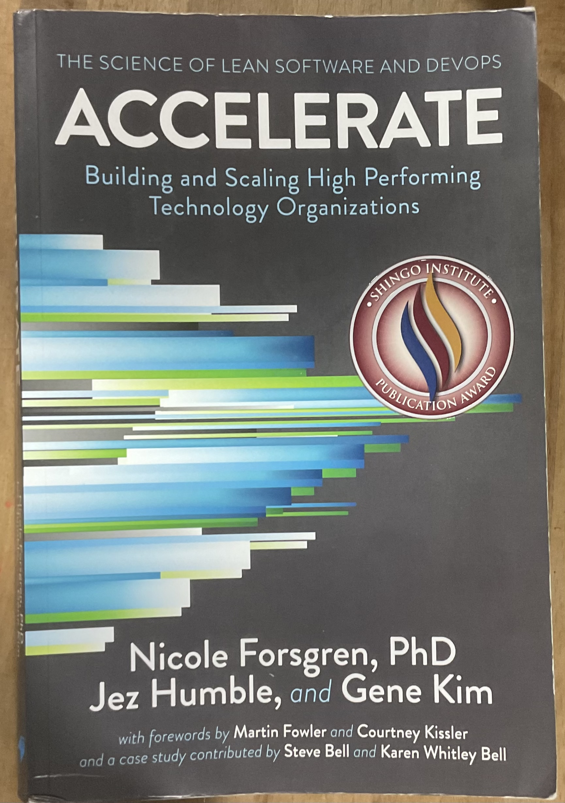

Authors: Nicole Forsgren, Jez Humble, Gene Kim

The book tries to demonstrate by statistical analysis done with a broad spectrum of businesses how certain practices such as lean management, agility, product oriented decoupling and leadership can make the difference between low performers and high performers in IT.

Most of it seems common sense when you are already working as part of a big organisation, so in a way it’s quite reassuring that someone went to great lengths to try to prove it through statistics. That makes this a good book for managers, but a painful one to read for developers and technical team members. It does feel like a huge master powerpoint trying to convince decision makers rather than doers.

Most of the book content is in part 1 which introduces the statistical model and its results. I skipped entirely part 2 which supposedly gives the statistical methodology used for obtaining meaningful results. I will just suppose they did their work correctly otherwise the book wouldn’t be so widely adopted in the IT industry. Part 3 is probably the best part of the book, and illustrates how the right combination of organizational and technical practices can effectively give birth to a completely different way to build and maintain IT services.

## The good
For once, it is refreshing to read a preface (Martin Fowler) by someone who does not just praise the book for its quality but points out its limits and warns the reader to make its own opinion.

## The less good
Structure of the book is messy, it’s hard to understand where we are when reading the book. Subsection titles are centered and anywhere on the page with no numbers referencing the parent section… And worse even, part three is labeled part two in the bottom of each page. 

The book feels like a conglomerate of big buzz words like « generative culture », « mentoring », « transformational leaders », « diversity » which gives me high bullshit alerts. It all makes sense when you’re already convinced of it, but there is no room to go into details on how those notions actually influence teams with facts, examples, etc. But that would make a much bigger book to read, and one I would definitely NOT read.