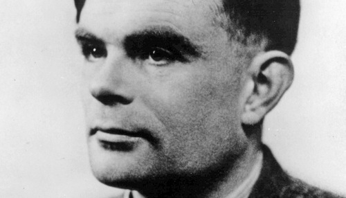

# Pélerinage à Station X

 Pour bien des gens, ce visage n’évoquera rien. D’autres, peu nombreux, y verront le père de l’informatique moderne. Alan Mathison Turing reste, plus de 50 ans après sa mort, un illustre inconnu pour le commun des mortels. Sa contribution dans l’histoire des sciences n’en est pourtant pas moins spectaculaire et mériterait à certains égards autant de respect que le travail de son contemporain Albert Einstein. Mais Turing n’a pas eu le droit à sa part de gloire. Non. Et aujourd’hui encore son histoire, pourtant fascinante, peine à être connue et reconnue.

 Fait étrange, je me rappelle, alors en première année de prépa, être tombé un peu par hasard sur une émission radio un dimanche matin entre 1h et 2h du matin sur France Inter. Le mot Turing en est resté gravé dans ma mémoire et, fait encore plus étrange, n’a jamais cessé de réapparaître périodiquement par la suite. Quatre ans plus tard, je me retrouve curieusement à quelques coups de pédales de ce qui fut un temps "le secret le mieux gardé d’Angleterre" et qui conserve encore entre ses murs la trace du génie d’Alan Turing.

 Nous sommes en 1939 et la Seconde Guerre Mondiale vient d’éclater. En Angleterre, les services de renseignement s’organisent et établissent un centre de décryptage à Bletchley Park, alors connu sous le nom de code Station X. De son côté, l’Allemagne nazie met en place un système de chiffrement des communications extrêmement efficace basé en partie sur une version améliorée de la machine Enigma. Si cette Enigma ne ressemble vue de loin qu’à une vulgaire machine à écrire, elle possède néanmoins quelques 138 000 000 000 000 000 000 configurations différentes et donc autant de chiffrements possibles... De quoi en décourager plus d’un à une époque où casser un code devait se faire à la main, et surtout de quoi convaincre les allemands que leur système était absolument indéchiffrable!

 Face à l’ampleur du travail à effectuer à Bletchley Park, le gouvernement appelle alors en renfort un certain nombre de cerveaux pour mettre au point dans le plus grand secret des méthodes de cryptanalyse efficaces. Parmis eux, Alan Turing, et tandis qu’Einstein avertit Roosevelt de la réalisation possible d’une bombe atomique, une autre "bombe", cette fois beaucoup moins destructive mais peut-être tout aussi décisive, naît dans l’esprit de Turing. Réalisée en l’espace de quelques mois, cette "bombe" a permis de décrypter par la suite plusieurs dizaines de milliers de messages allemands, principalement en provenance de U-boats, et a joué un facteur décisif dans la victoire alliée de la Bataille de l’Atlantique. Lancées toutes les nuits à minuit, heure à laquelle la configuration d’Enigma était changée, ces machines de plusieurs mètres cubes (cf. photos) étaient lancées afin de casser mécaniquement en quelques heures la clé de cryptage du jour à partir de signaux interceptées par les alliés.

 Le travail réalisé à Bletchley Park est à de nombreux égards remarquable (et pas seulement celui d’Alan Turing; en 1945, près de 9000 personnes travaillaient dans les cabanes de Station X) et a joué un rôle essentiel dans la naissance de l’informatique. C’est ici notamment que Colossus, le tout premier ordinateur électronique programmable, a vu le jour en 1944 afin de décrypter les messages encodés par une autre machine allemande utilisée par le haut-commandement. Mais Station X est restée secret défense jusqu’au milieu des années 1970, et l’ensemble du matériel a été entièrement démantelé au lendemain de la guerre, ce qui explique l’absence de référence à Bletchley Park dans les bouquins d’histoire. L’histoire de l’informatique avait depuis été écrite ailleurs, aux Etats-Unis notamment avec l’ENIAC...

 Il est difficile de décrire en quelques mots seulement l’importance du travail et l’intelligence exceptionnelle mise en oeuvre ici à Bletchley Park, et je ne saurais assez conseiller à tous ceux qui s'intéressent à l’histoire et/ou aux sciences de passer une après-midi là-bas. Quant à Alan Turing, la cryptanalyse d’Enigma ne représente finalement qu’une infime partie de ses réalisations, et il faudrait des pages et des pages pour mieux comprendre le personnage. Heureusement pour le lecteur rebuté par cette longue page d’histoire, je ne m’aventurerais pas plus en avant dans le récit des aventures passionnantes de Turing l’homosexuel persécuté, et je préfère simplement terminer cet exposé par cette citation qui lui est attribuée :

 > It’s not breaking the code that matters, 
 > it’s where you go from there...
