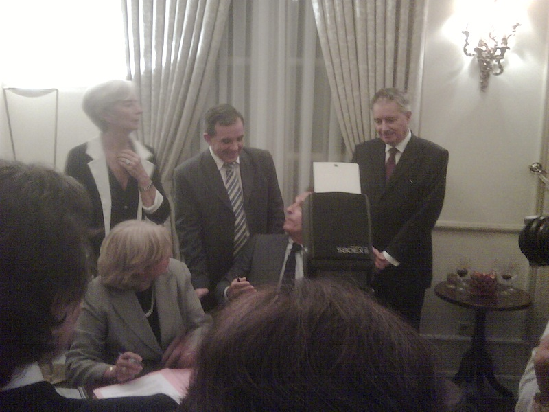

---

title: "Lagarde-à-vous!"

date: 2011-02-27T07:10:00+00:00
comments: false
categories: 
- life
tags:
- indonesia
- france 
---

Jeudi soir je me suis offert un petit moment Ferrero Rocher à la résidence de France à l'occasion de la visite de Mme Christine Lagarde et M. Thierry Mariani à Jakarta. Soirée très privée, puisque même Irma que j'avais annoncé comme étant mon épouse n'a pas été autorisée à assister à l'évènement, celui-ci étant "strictement professionnel". 14 années qu'un ministre français n'avait pas mis le pied sur le sol indonésien, et le taux de croissance de 7% aidant, il était grand temps que la France revienne y placer ses billes.

Madame Lagarde nous a donc gratifié d'un discours élégant dans un anglais impeccable, tandis que Monsieur l'Ambassadeur usait de son magnifique accent français pour une introduction dans un mélange de langue de Shakespeare et de bahasa. Finie la crise, n'écoutez pas les médias, et bonjour le business. Tels étaient donc les propos tenus devant la délégation de chefs d'entreprise réunis par le Medef International pour l'occasion. Beau discours, toasts, champagne, plafonds à caisson, lumière tamisée, tout était réuni pour que le VIE affamé que j'étais se sente "vraiment gâté".

Seulement, entouré des grands de ce monde affairés à s'échanger des cartes et discuter avec le Trésor, moi je me demandais bien ce qui m'avait valu une invitation. L'air paumé, vêtu d'une simple chemisette en lin (qui m'a d'ailleurs valu un "Vous auriez pu faire un effort vestimentaire Monsieur!" par l'officier à l'entrée), moi je n'en menait pas large avec mon verre de vin dans une main, une tartine de foie gras dans l'autre. L'officier m'avait à l'œil et j'aurais eu trop peur de terminer en (La) garde-à-vue pour exiger des Ferrero Rocher!
