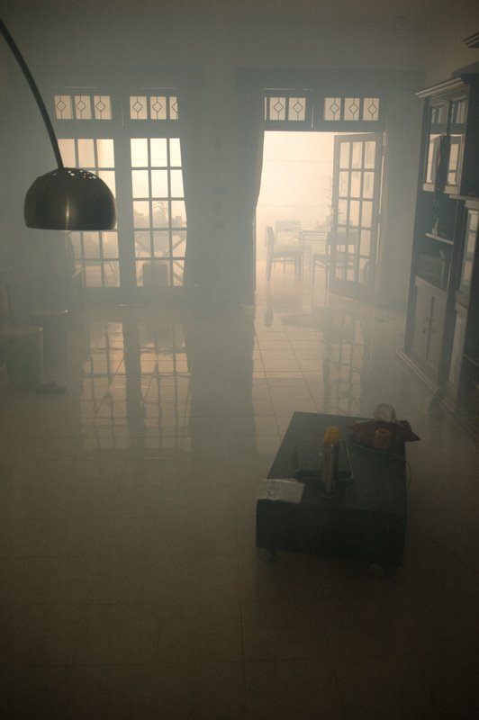

Dans la même lignée que le Tangkuban Perahu, nous avons eu une autre expérience quelque peu *fumeuse* le week-end dernier, mais cette fois-ci chez nous à Jakarta! Nous avons en effet eu le plaisir d'accueillir chez nous un charmant jeune homme samedi dernier équipé de ce qui ressemblerait le plus à un bazooka-lance-flamme-à-pompe. Son engin a craché quelques flammes, laissé couler deux trois gouttes d'une substance douteuse, avant d'envelopper notre séjour dans un épais nuage de fumée toxique affolant les moustiques à la ronde. RIP la vilaine Aedes Aegypty, moustique d'apparence zébrée qui a entre outre la très facheuse tendance de distribuer à tire d'aile le virus de la dengue. Espérons qu'elle ne revienne plus pointer le bout de sa trompe par ici...

