Voici les photos de notre dernier weekend. Cette fois-ci, destination Pangandaran, à 300km au sud-est de Jakarta pour y descendre une rivière en canyoning. Evidemment, une fois n'est pas coutume, il nous a fallu pas moins de 8h de bagnole pour arriver à notre but et plus de 12h au retour. Sur un weekend de 2 jours ça fait un peu beaucoup, mais ça valait tout de même le coup!

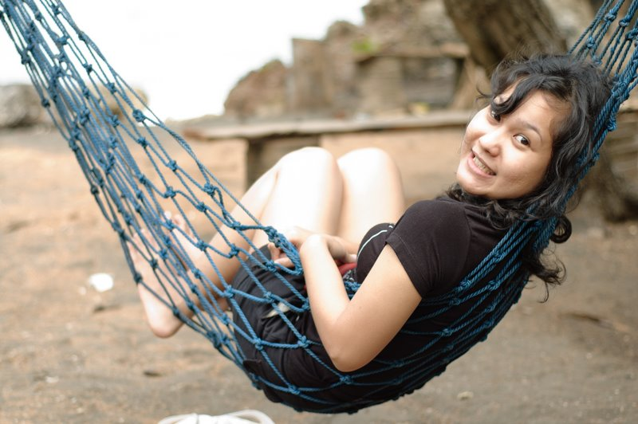

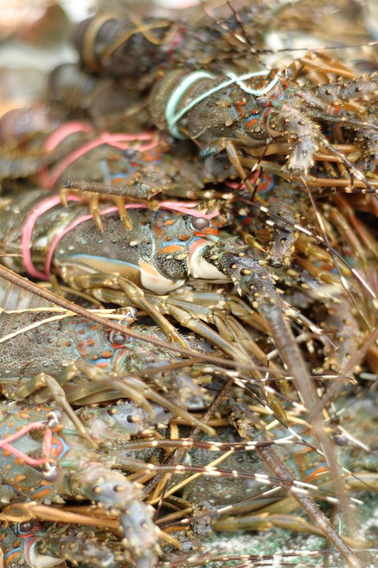

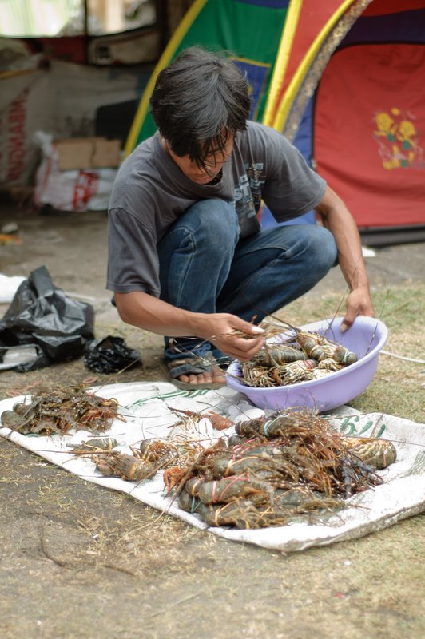

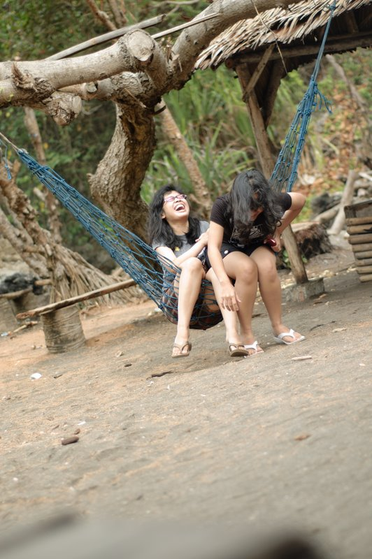

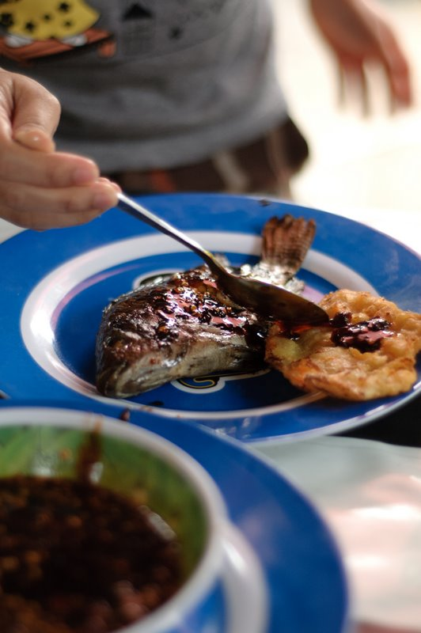

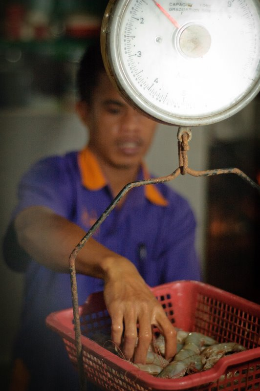

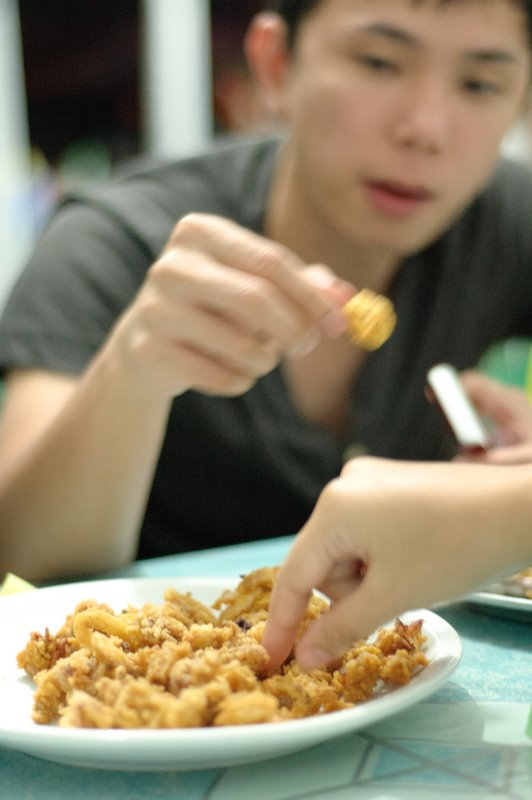

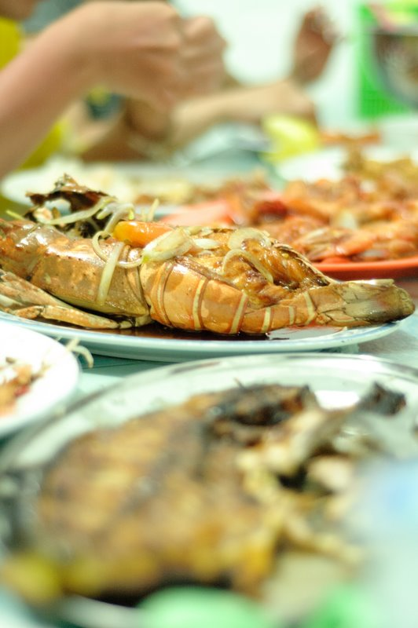

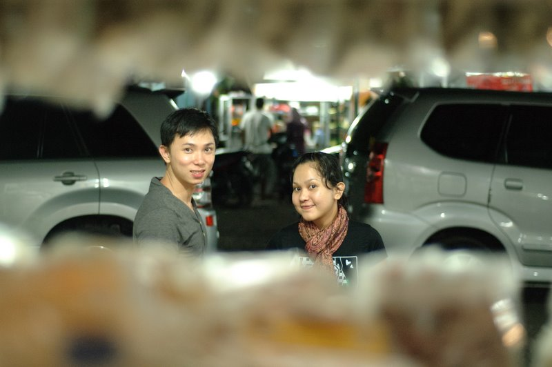

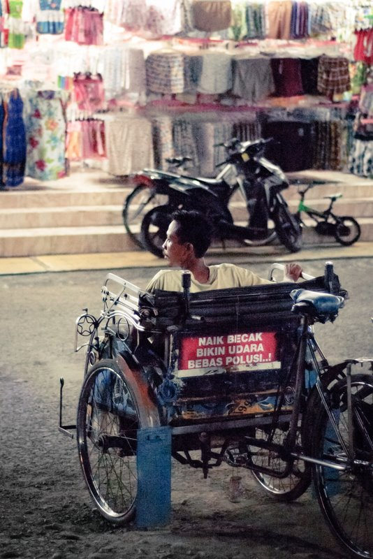

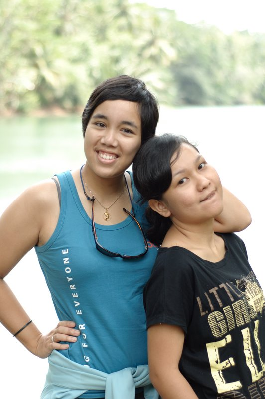

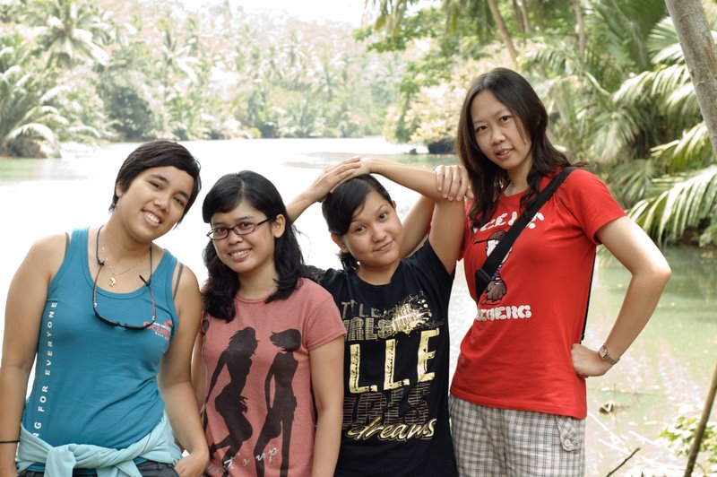

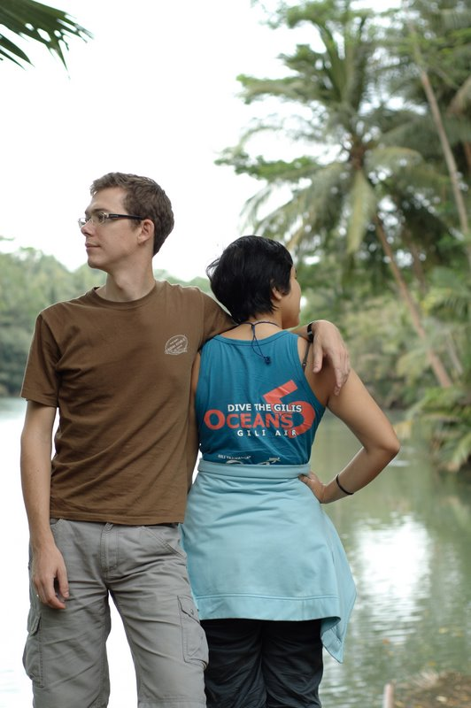

